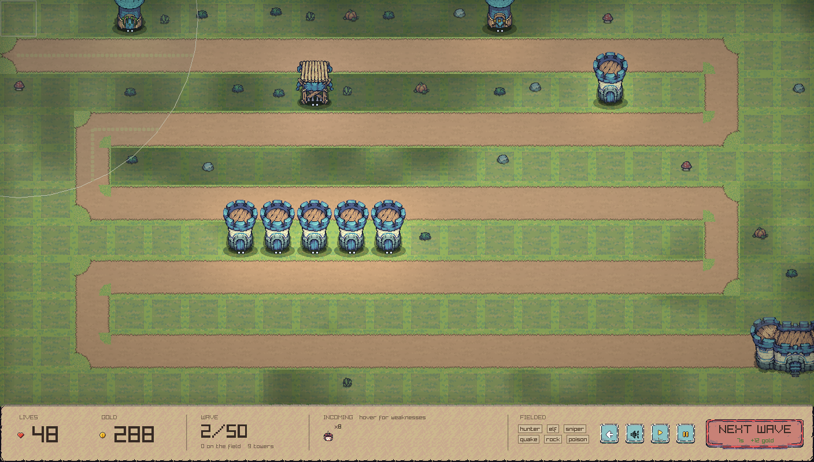
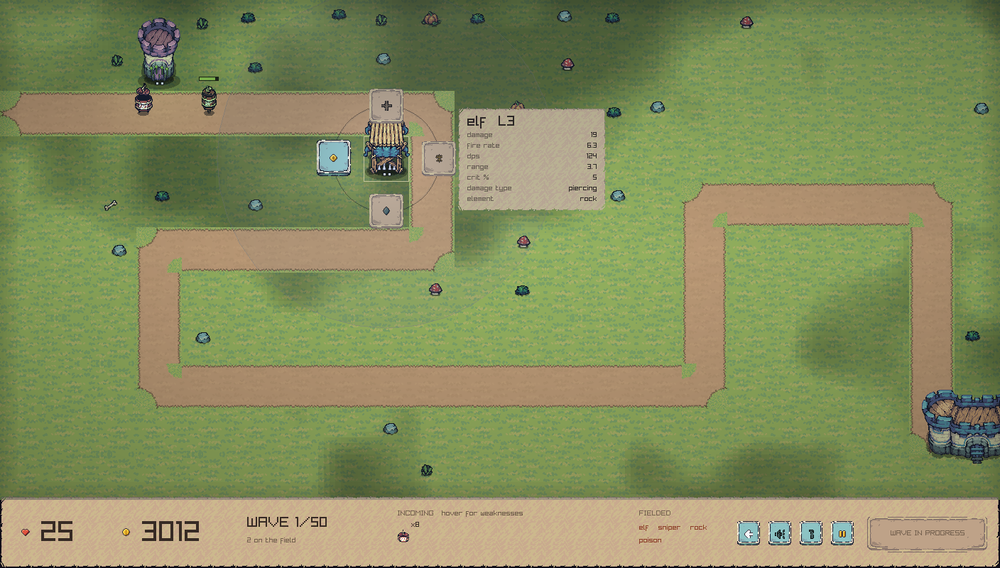
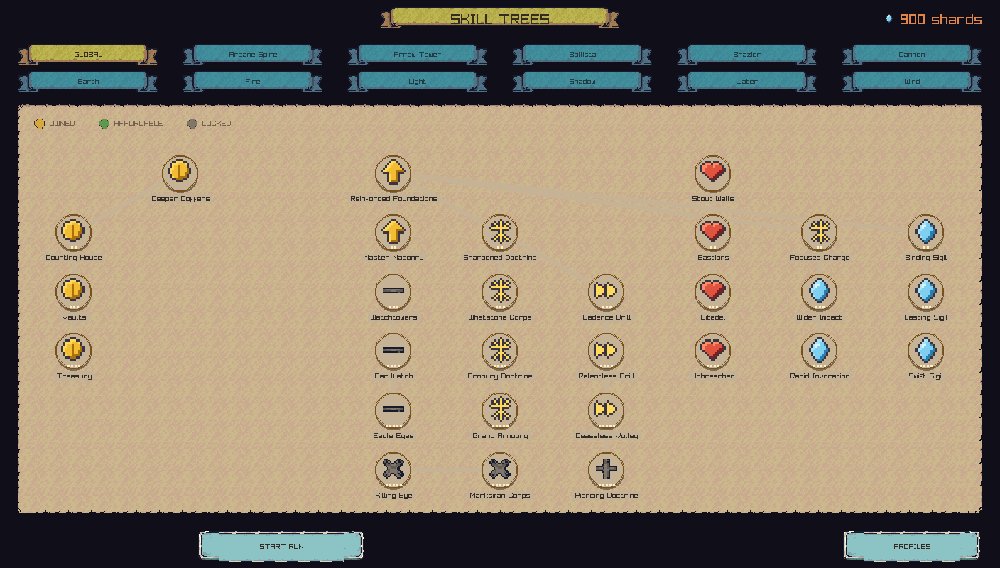
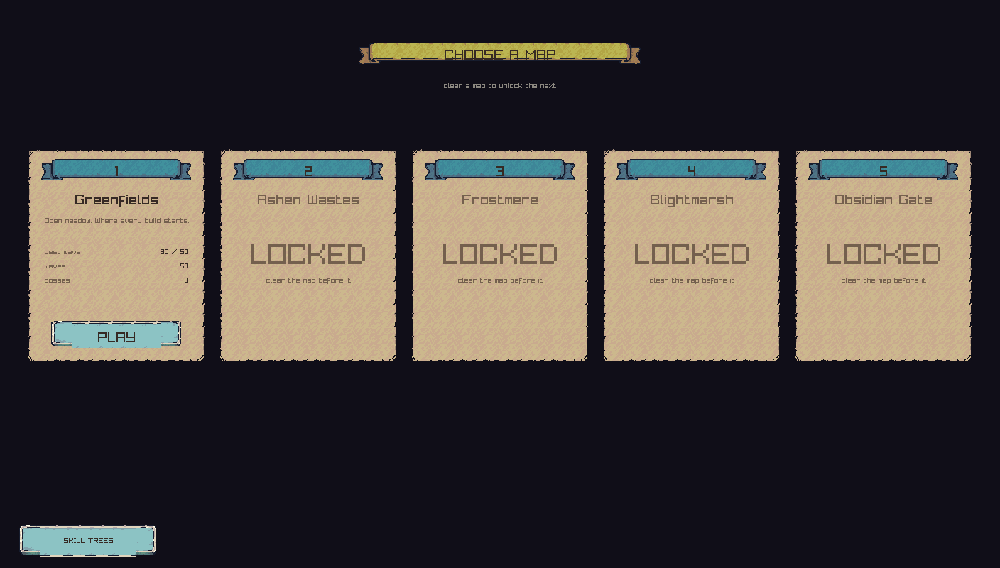
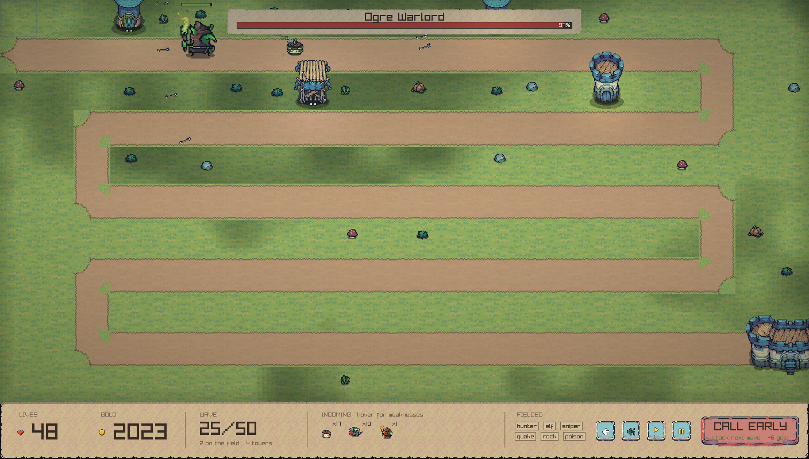
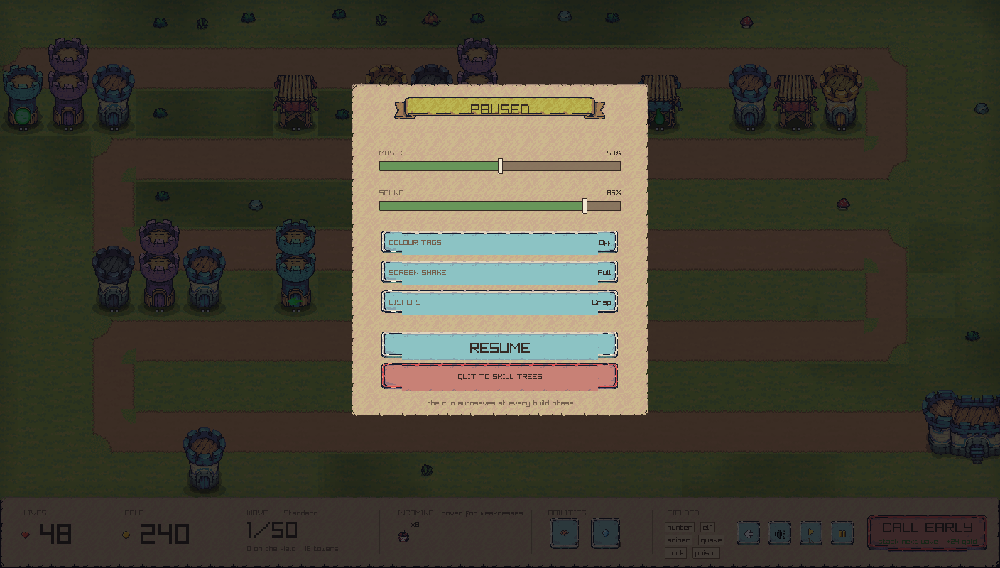

# Roguelike Tower Defence — *Wardstone*

A pixel-art roguelike tower defence in C++20. Towers specialise, elements
specialise, and the two **combine** — 270 distinct builds from 33 authored
pieces. Every map resists a different element, so the build that cleared the
last map is the wrong build for the next one.



---

## The idea

Most tower defence games give you a tower list. This one gives you a **matrix**.

- Build a tower, level it to max, then **specialise** it — an arrow tower becomes
  a sniper, an elf, or a hunter.
- Separately, **imbue** it with an element and specialise that too — earth
  becomes poison, rock, or earthquake.
- Only **one of each specialisation may exist on the map at a time**, so a run is
  a sequence of commitments, not a shopping list.
- **Everything above is unlocked by the skill tree.** Levelling a tower past 1,
  imbuing an element and specialising at all are all bought permanently, so a
  first run fields plain level-1 towers and the meta progression is what turns
  them into a real board.

The combinations are the game. A tower spec changes *numbers and geometry*
(damage size, fire rate, how many projectiles); an element spec changes *events*
(what happens on shoot, on hit, on kill, on tick). Because element potency scales
with hit **magnitude**, hit **count**, or **time**, the firing profiles
differentiate the elements on their own — nine behaviours emerge from six
authored pieces, and 270 from 33, with **no per-pair code anywhere**. A test
suite enforces that: if a combination ever needed special-casing, a guardrail
fails.

Progress is permanent. A lost run pays out shards, and shards buy nodes in twelve
skill trees that persist across runs.

## Content

| | |
|---|---|
| Towers | 5 — arrow, cannon, arcane spire, ballista, brazier |
| Tower specialisations | 15 (3 each) |
| Elements | 6 — earth, fire, water, wind, shadow, light |
| Element specialisations | 18 (3 each) |
| **Combinations** | **270** |
| Maps | 5, each 50 waves, with bosses at 25, 40 and 50 |
| Bosses | 15 |
| Enemies | 45 definitions over 14 creature sets, 6 of them flying, with per-damage-type resistance tables |
| Skill trees | 12 trees, 156 nodes, 5629 shards — the global tree alone is 29 |
| Damage types | 11 |
| Audio | 2 CC0 music loops + 13 CC0 effects, committed; procedural synth as fallback |

Each map's roster resists a different element and is vulnerable to another, which
is what makes five maps replayable rather than one map five times.

## Screenshots

| Tower inspection | Skill trees |
|---|---|
|  |  |

| Map select | Boss fight |
|---|---|
|  |  |



## Architecture

The one rule everything else follows: **`td_core` must never link raylib.**

```
src/core/     pure logic — stats, damage, RNG, saves, skill trees
src/content/  TOML loading and validation
src/sim/      the simulation — ECS, systems, element behaviours
              ^^^ none of the above may include raylib. Enforced at CMake configure time.
src/render/   raylib rendering, sprite atlas, shaders
src/ui/       screens, HUD, radial menu
src/app/      screen state machine and the fixed-timestep loop
```

That boundary is why the whole game is **headlessly testable**, and it pays for
itself constantly:

- A **simulated player** (`sim::AutoPlayer`) plays complete runs with no window,
  so difficulty is *measured* rather than guessed. It found a wave-4 death spiral
  and a meta-progression that ended in one run — neither visible by inspection.
  It fields a **mixed board**, choosing towers by how the map's roster resists
  their damage type: it used to build only arrow towers, which made every figure
  it produced a faithful reading of a board no player would field.
- A **combination matrix** (`sim::Scenario`) runs all 270 pairings against fixed
  scenarios and asserts relational guardrails, never magic numbers. It caught a
  spec measuring 79% against a row median of 23%. Its guardrails used to compare
  specs only against **each other**, which structurally cannot catch a whole
  tower's specs being bad — so support builds — whose value lands on
  *other* towers — read as broken. The scenario also left every tower but the
  specialised one at level 1, which biased it against them again. Fixing both
  collapsed the spread across the fifteen specialisations from **7.9× to 3.6×**
  without touching a single content value. There is now also a test that every
  spec beats the same tower **unspecialised**.
- The same harness caught the worst bug in the project so far. `levelUnlocked()`
  checked `owns("global.unlock.level2")`, but that string is a **flag granted by**
  the node `global.level2` — and owned-node sets hold node ids, never granted
  flags. So tower levels 2 and 3 were unreachable for every real player, and
  *every existing guardrail passed* because they all used the test-only `ownAll`
  shortcut, which bypasses the gate. It surfaced only when the meta-loop report
  simulated buying nodes: a profile owning **all 150 nodes** stalled at wave 42
  of 50 with every tower stuck at level 1, while `ownAll` cleared all 50. The
  lesson is now a test (`tests/sim/test_unlock_gates.cpp`): *a gate verified only
  through `ownAll` is not verified.* The gate is also resolved from the tree
  rather than by node id, so a rename cannot silently seal it again.
- Balance asks **value per gold**, not damage per tower. The matrix reports
  output per tower, but towers cost 105 to 192 and the game runs a measured gold
  deficit, so gold is what binds. On raw output brazier looks like the weakest
  family; per gold, using each family's best pairings, it has a low mean and a
  high ceiling — which is what a *specialist* looks like, and what its design
  says it is. Arcane was low on both, meaning no good pairing at the highest
  price: a bad purchase in every situation rather than a specialist. Fixed.
- Balance is driven by `tools/balance.py`: authored base stats plus named
  multiplier profiles, so tuning is idempotent, reversible and auditable.
- A **reachability guardrail** asserts a fully-upgraded profile gets at least 76%
  of the way through *every* map. The game shipped mathematically unwinnable for
  three passes — the HP curve was `1.055 ^ (wave^1.18)`, so health multiplied 7×
  between wave 34 and wave 50 while the player, already fully built, gained
  nothing. This test exists so that cannot recur silently.
- Per-map difficulty is **normalised against path length** in `tools/make_map.py`,
  which solves each map's HP curve from a declared target, its actual tile count
  and its wave-50 enemy count. Damage dealt is proportional to how long enemies
  are under fire, so changing a route would otherwise silently change how hard a
  map is. Before normalising, two maps were ~2× harder than the rest.

Other load-bearing decisions:

- **Deterministic.** One seeded `std::mt19937_64` per run, injected everywhere;
  `rand()` is prohibited; the RNG state is serialised into saves, so resuming a
  run continues the same random sequence. Resuming also restores the run's
  statistics and its ability cooldowns — neither used to be saved, so a reload
  wiped everything the results screen reports and handed back any ability the
  player had just spent. The autosave fires whenever the run has **changed**
  rather than once per wave, and the game flushes on exit: closing the window
  used to discard the entire current build phase, which is the moment a player
  spends their gold.
- **Fixed 1/60s timestep** with an accumulator, and render interpolation.
- **Music is generated, not licensed.** `core::Music` composes two minor-key
  loops from the same raylib-free synthesiser the sound effects use, wraps the PCM
  in a WAV header in memory, and streams it. Nothing on disk, nothing to license.
- **Content is data.** Towers, elements, enemies, maps, wave recipes and skill
  trees are all TOML. A new element is one TOML file, one tree, one behaviour
  file, and one line in a dispatch table.
- **Integer-scaled pixel art.** Everything renders to one virtual 1408×800
  canvas, blitted at an integer scale — fractional scaling is what makes pixel
  art shimmer, so it is never allowed.

## Building

Requires a C++20 compiler, CMake ≥ 3.24 and Ninja. Dependencies are fetched
automatically by CPM: raylib, EnTT, toml++, nlohmann/json, Catch2.

```sh
cmake -B build -G Ninja
cmake --build build
./build/td_app
```

Tests:

```sh
ctest --test-dir build          # 293 tests
```

A plain `cmake -B build` produces an optimised `RelWithDebInfo` build, which is
what the line above assumes: the same suite takes **9 seconds** there against
**450 seconds** under `-DCMAKE_BUILD_TYPE=Debug`. The default used to be Debug,
so anyone following these instructions to *play* the game got an unoptimised,
assert-enabled binary. Two opt-in reports are worth running by hand:

```sh
./build/tests/td_tests "print the combination matrix" -c "[.report]"
./build/tests/td_tests "report how many runs it takes to clear map 1" -c "[.report]"
```

The second reports **two** purchase policies, because the answer depends far more
on how shards are spent than on how many are earned:

| policy | what it models | map 1 falls on |
|---|---|---|
| `greedy` | cheapest prereq-met node anywhere | not within 24 runs |
| `planned` | pushes one line and *saves* for it | **run 21** |

**"Hardcore, limited resources" and "map 1 in 8–10 losses" are the same dial
pulled opposite ways.** Both were asked for; neither is reachable while there is
only one tuning. That is why difficulty exists, and the report measures each:

| difficulty | runs to clear map 1 |
|---|---|
| Relaxed | **9** |
| Standard | 18 |
| Brutal | not within 24 |

Nine is the middle of the target the project chased for rounds without hitting.
It did not need better tuning; it needed to stop being one number.

Greedy is kept as a floor and as a warning: the six element trunks are the
cheapest nodes in the game, so it buys all six first, and under a gold deficit
that makes it measurably *worse* — an unlocked element invites spending scarce
gold on imbuing instead of building, and measured waves fall from 14 to 10 over
the opening runs.

### Useful dev flags

```sh
./build/td_app --autostart              # skip menus, straight into a run
./build/td_app --map frostmere          # force a map
./build/td_app --wave 24                # jump to a wave (boss fights)
./build/td_app --hub --tab 3            # a specific skill tree
./build/td_app --maps                   # map select
./build/td_app --pause                  # open the settings overlay
./build/td_app --menu 8 2 --menupage targeting   # a tower's targeting ring
./build/td_app --cluster 9              # towers along the route
./build/td_app --openslot 0             # open a profile the way clicking it does
./build/td_app --freshrun               # the REAL opening: 275 gold, 20 lives
./build/td_app --mouse 568 755          # park the cursor, so hover states render
./build/td_app --shot out.png --after 8 # render N seconds then screenshot
```

`--openslot` comes before anything that starts a run: a run begun without a
profile open reads a default one, and opening a profile afterwards resets the
screen.

`--mouse` matters more than it looks. Hover carries a whole layer of this game's
information — the radial menu's detail card, the HUD's enemy dossier, a skill
tree node's derived numbers — and a capture leaves the cursor at (0,0), where
none of it is showing. Two of the bugs in `docs/superpowers/plans/` were found
only once hover could be photographed.

Two environment variables make captures reproducible, and the screenshots in
this README are regenerated by one script rather than by hand:

```sh
TD_SAVE_DIR=/tmp/save   # profiles live here instead of the real save directory
TD_RUN_SEED=20260902    # pins the run seed, which waves are drawn from
tools/shots.sh          # rewrites docs/screenshots/ from a stated profile
```

`td_shot` is the same game linked against raylib's software renderer, so all of
this works with no display at all — including over SSH and on a locked screen.

```sh
cmake --build build --target td_shot && tools/shots.sh
```

## Assets

**Audio is in the repository. Art is not.** Both follow from the licences: the
audio is CC0, which permits redistribution; the sprite packs permit use and
modification in a shipped game but forbid redistributing the source art.

### Audio — committed

Each cue holds a pool of voices so a busy wave can overlap the same sound: one
real `Sound` plus `LoadSoundAlias` copies that **share its sample data**. They are
freed with `UnloadSoundAlias`, never `UnloadSound` — the latter frees the shared
samples, so a pool of one source and three aliases used to be four frees of one
allocation, on every cue, every shutdown. Confirmed under AddressSanitizer as
`double-free raudio.c in UnloadAudioBuffer`.

Two CC0 music loops from OpenGameArt and 13 CC0 effects from Kenney. Sound
effects are looked up by filename (`assets/audio/sfx/<cue>.ogg`), so any cue can
be replaced by dropping in a different `.ogg` — no rebuild. The procedural
synthesiser remains as a fallback for any missing file.

### Art — not committed

Committing the sprites would breach their licences, so `assets/sprites/*.png` is
gitignored and the importers are committed instead:

```sh
python3 tools/import_tinyswords.py ~/Downloads   # terrain, towers, creatures, UI kit
python3 tools/import_magic.py      ~/Downloads   # element icons, projectiles, overlays
```

Every sprite id has a procedurally generated fallback (`content/art/sprites.toml`),
so **a fresh clone builds and runs** without any downloads — it just looks like
the prototype until you run the importers.

See [`docs/ASSET-POLICY.md`](docs/ASSET-POLICY.md) for which packs were cleared,
which were rejected and why. Two were rejected after checking the licence at
source contradicted what search results claimed.

## Fitting the screen

Integer scaling with nearest neighbour is lossless, so it stays the default and
letterboxing is the accepted cost. What is *not* a preference is cropping: the
old rule was `max(1, min(sw / vw, sh / vh))` with integer division, and the floor
of 1 meant a window smaller than the canvas still drew at 1:1 — on a 1366×768
laptop the game rendered at **107% of the screen** and the bottom of the HUD was
cut off and unclickable. It now scales down when it has to, and offers Fill for
players who would rather use a whole 1440p monitor than 31% of one.

The base resolution is the real constraint and this does not fix it: 1408×800
divides no common display, which is why crisp mode sits at 1× everywhere below
4K. A base like 320×180 would scale cleanly, but changing it moves every UI
coordinate, the 64px tile and the 22×11 grid.

## Accessibility

Measured against [Steam's published accessibility feature list](https://partner.steamgames.com/doc/accessibility_features),
which now shows on store pages and which players can filter by. **Colour
alternatives**: eleven damage types were separated by hue alone in the readout
that tells you what to build against — and two pairs are barely separable *with*
full colour vision (`arcane` against `void`, `radiant` against `shock`). Each now
carries a two-letter tag, and a test walks every damage type in the content and
fails if one is untagged or shares a tag. **Camera comfort**: screen shake has
Full / Reduced / Off, applied inside `shakeOffset()` so every consumer honours
it. Three settings rather than a toggle, because shake is feedback and removing
it entirely costs the player information.

## Difficulty

Three settings, chosen on the map select screen. Each scales several modest
things — enemy health, how many arrive, starting gold and lives — rather than one
large health multiplier, because scaling health alone changes how *long* a wave
takes while changing the count changes what a wave *is*.

**Standard is a true no-op**, and there is a test asserting it: every balance
measurement in this repository was taken there, and if Standard were not identity
they would all silently stop meaning what they say.

Nothing reduces shard payout below baseline. Taxing the meta progression of
players who chose the easier setting punishes exactly the people who needed it,
and it is the design players most often say makes them doubt a game's fairness.
Brutal pays 35% more instead — harder is rewarded rather than easier being taxed.

## Saying what things do

Every specialisation shows the **exact figures it gives you** — Sniper is not
"far heavier shots", it is `damage x2.6, fire rate x0.45, range x1.7, crit +20%,
armour pen +4, execute below 60%`. All 33 specialisation cores previously carried
prose and not one number between them, which made the decision that defines a
whole build a guess.

The figures are **derived from each node's own modifiers**, never written by
hand, so retuning a value updates the text automatically. Hand-written numbers
drift, and a description that lies is worse than one that is vague.

## Learning the game

A guided first run, on Greenfields, in an ordinary run that counts — not a
separate sandbox. Five steps, each gated on the player actually performing the
action rather than on a timer or a "click to continue": build, send the wave,
open a tower, spend gold, use an ability. It advances past anything you have
already done, so it never asks you to do something twice, and it is skippable at
any point. Most people who quit a game quit inside ten minutes, which makes this
the highest-leverage part of the product.

## Abilities

Two, free and on cooldowns rather than costing gold, and **bought up in the
global tree** like every other capability — damage, radius and a flat cooldown
reduction, the same axes Kingdom Rush upgrades its Rain of Fire along. They were
the only system in the game a player could never improve.

**Strike** (Q), an immediate
blast whose damage scales with the wave's own health multiplier so it means the
same thing on wave 3 and wave 50, and **Ward** (W), a field that holds enemies
and deals no damage at all. They are deliberately free — under a gold deficit
they are the one form of agency scarcity cannot take away, so a losing board is
never purely a spectator. Before them, once your towers were placed there was
nothing to do until the next build phase.

## Placing a tower

Buildable ground is marked on the board — quiet at rest, lifted while you are
choosing — and hovering a site shows the **range the tower would have** and
highlights the stretch of route that range actually covers. Coverage is the
figure that decides whether one tile beats another, and it used to be invisible:
the range ring only appeared once a tower already existed, so every first
placement was blind and could only be undone at a loss.

## The screens

Map select shows each map **drawn from its own tile grid** — the route, the
start, the goal — and states the map's elemental bias, computed from that map's
roster so the screen cannot contradict the enemies it sends. A map with no real
tilt says so rather than inventing one.

The skill trees draw their prerequisite wiring whether or not you own it. They
used to mix unowned links 62% toward the parchment behind them, so the structure
of a 150-node tree only appeared once you had already bought it.

## Documentation

- [`docs/ART.md`](docs/ART.md) — the art pipeline, and the mistakes worth not
  repeating: measured frame pitches, baked contact shadows, nine-slice tiling,
  why light pools must saturate.
- [`docs/ASSET-POLICY.md`](docs/ASSET-POLICY.md) — licence clearances.
- [`THIRD_PARTY_LICENSES.md`](THIRD_PARTY_LICENSES.md) — dependency licences,
  generated by `tools/gen_third_party_licenses.sh`.
- `docs/superpowers/specs/` — the design spec.
- `docs/superpowers/plans/` — implementation plans, each with an execution log
  recording what actually happened and where the plan was wrong.

## Status

Playable end to end: profile select → skill trees → map select → 50-wave run with
bosses → results → spend shards → repeat.

The whole campaign is reachable: the difficulty curve used to be
super-exponential and made maps 2–5 unreachable content. That is fixed and pinned
by a test — a fully-upgraded profile now gets 76%+ of the way through every map
using only arrow towers, which is a lower bound on a real player with five tower
types.

Balance is measured rather than asserted, and the numbers are re-read whenever
something moves them. Averaged over 24 seeds on Greenfields, a **fresh** profile
builds about 15 of the map's 29 build plots and dies around wave 11. A **fully
upgraded** profile clears the first three maps on Standard; the last two are a
coin flip (4 of 8 seeds and 3 of 8), and on Brutal neither is beaten. So the
endgame is a ladder rather than a formality.

**What binds changes over a run**: gold in the opening, the map itself at the end
— a finished board fills every plot Greenfields has and still wants more. Before
plots were authored the map offered 144 buildable tiles and the strongest run
used 34, so placement was never a decision and the cheapest tower won every
marginal build.

The campaign is ordered, and was not: measured with one profile, waves survived
ran 10.0, 8.5, 9.0, 9.5, 4.0 against an authored order of 1–5. The health curve
had been pinned at wave 50 only, so a map's difficulty dial moved wave-50 health
by 18% and wave-10 health by 1.6% — nothing, where players actually lose. Pinned
at both ends and calibrated against real runs it now reads 10.8, 9.7, 8.2, 7.0,
3.8, guarded by a test that fails on the old values.

Every tower's **targeting** is the player's to set — first, last, strongest,
weakest or closest — which is the decision a wave is actually made of. **P is a
tactical pause**: the simulation stops but the board stays live, so you can
build, upgrade, sell and re-target while it is frozen, and think rather than
react. (ESC is the settings menu, which does block.) Speed runs at 1x / 2x / 4x /
8x, and the next wave can be **called on top of a running one** for gold proportional to what is still unresolved — the only income
source the player controls, which is what makes the gold deficit a decision
rather than a wait.

Known gaps, honestly:

- The tutorial does not yet **point at** anything — it names the button but does
  not highlight it, and the onboarding research asks for clear visual cues. Text
  alone is weaker than text plus a highlight.
- The simulated player never **specialises** a tower or imbues beyond its one
  chosen element, so the 270 combinations are still unexercised by any full-run
  measurement. The combination matrix tests them in isolation, which is not the
  same as a board using them.
- **Adjustable text size** is the one Steam accessibility category still
  unmet. Every caption is a literal size at its call site, so it needs routing
  through a helper rather than a setting bolted on.
- **Tower art is fixed but capped by the pack.** All 20 tower sprites now use a
  tower silhouette; 16 of them used to be houses, barracks, archery halls and
  chapels, because Tiny Swords is a village builder. Tiny Swords contains only
  *three* single-tile tower silhouettes, so the fourth is composited (a second
  crenellated drum stacked on the keep). Five genuinely distinct tower families
  with per-upgrade-level art needs a purpose-built tower defence pack — see
  `docs/ASSET-POLICY.md` for the two verified options and `docs/ART.md` for why
  the chapel and the castle were rejected by looking at them.
